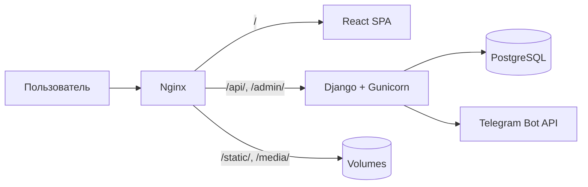

# Максимум

Сайт сервиса междугородних поездок **«Максимум»**: лендинг с тарифами и популярными маршрутами, калькулятор стоимости поездки и приём заявок через REST API.

**Production:** [parkmaximum.ru](http://parkmaximum.ru)  
**Сервер:** `5.35.84.172`

---

## Содержание

- [Возможности](#возможности)
- [Стек технологий](#стек-технологий)
- [Архитектура](#архитектура)
- [Структура проекта](#структура-проекта)
- [Требования](#требования)
- [Быстрый старт (Docker)](#быстрый-старт-docker)
- [Локальная разработка](#локальная-разработка)
- [Переменные окружения](#переменные-окружения)
- [API](#api)
- [Админ-панель](#админ-панель)
- [Начальные данные (seed)](#начальные-данные-seed)
- [Деплой на сервер](#деплой-на-сервер)
- [HTTPS и Certbot](#https)
- [Полезные команды](#полезные-команды)
- [Решение проблем](#решение-проблем)

---

## Возможности

### Frontend
- Главная страница: hero, о компании, популярные маршруты, тарифы с каруселью автомобилей
- Страница **Калькулятор** (`/calculator`): расчёт расстояния и стоимости, выбор тарифа, дата/время, отчётные документы (+10%)
- Подсказки адресов (Nominatim / Yandex Geocoder), маршрут через OSRM, карта Yandex Maps
- Модальное окно заказа с отправкой заявки на backend
- Цены тарифов и маршрутов подтягиваются из API

### Backend
- Django Admin для управления тарифами, автомобилями, маршрутами и заявками
- REST API для frontend
- Экспорт заявок в XLSX по месяцам
- Фильтры заявок: статус, тариф, отчётные документы, даты
- Telegram-уведомления при новой заявке (опционально)
- Автоматический seed данных при первом запуске

---

## Стек технологий

| Слой | Технологии |
|------|------------|
| Frontend | React 18, Vite 4, React Router 6, Tailwind CSS |
| Backend | Python 3.12, Django 6, Django REST Framework |
| База данных | PostgreSQL 16 (prod), SQLite (local dev) |
| Инфраструктура | Docker, Docker Compose, Nginx, Gunicorn |
| Прочее | Poetry, Pillow, openpyxl, python-decouple |

---

## Архитектура



**Маршрутизация Nginx:**

| Путь | Куда |
|------|------|
| `/` | React SPA (статика из Vite build) |
| `/api/` | Django REST API |
| `/admin/` | Django Admin |
| `/static/` | Django staticfiles |
| `/media/` | Загруженные файлы (фото авто) |

---

## Структура проекта

```
park_maximum/
├── frontend/               # React SPA
│   ├── src/
│   │   ├── api.js          # HTTP-клиент к backend
│   │   ├── components/     # UI-компоненты главной
│   │   └── pages/          # Calculator, OrderModal
│   └── vite.config.js      # dev proxy → :8000
│
├── backend/                # Django project
│   ├── catalog/            # Tariff, Car, PopularRoute, RoutePrice
│   ├── orders/             # Order, signals (Telegram)
│   ├── config/             # settings, urls
│   ├── Dockerfile
│   ├── entrypoint.sh       # migrate → seed → collectstatic → gunicorn
│   └── requirements.txt
│
├── nginx/
│   ├── Dockerfile          # multi-stage: build frontend + nginx
│   └── default.conf
│
├── docker-compose.yml
└── .env.example            # шаблон для production
```

---

## Требования

**Production (Docker):**
- Docker 24+
- Docker Compose v2+
- Открытый порт 80

**Локальная разработка:**
- Node.js 18+
- Python 3.12+
- Poetry 2.x (опционально, для backend)

---

## Быстрый старт (Docker)

Один способ поднять весь проект локально или на сервере.

### 1. Клонировать репозиторий

```bash
git clone <repository-url> park_maximum
cd park_maximum
```

### 2. Создать `.env`

```bash
cp .env.example .env
```

Отредактируйте `.env`: задайте `SECRET_KEY`, `DB_PASSWORD`, `DJANGO_SUPERUSER_PASSWORD`.

Сгенерировать `SECRET_KEY`:

```bash
python3 -c "import secrets; print(secrets.token_urlsafe(50))"
```

### 3. Запустить

```bash
docker compose up -d --build
```

### 4. Проверить

| URL | Описание |
|-----|----------|
| http://localhost | Сайт |
| http://localhost/admin/ | Админка |
| http://localhost/api/v1/tariffs/ | API тарифов |

При первом запуске backend автоматически:
1. Ждёт готовности PostgreSQL
2. Применяет миграции
3. Заполняет начальные данные (`seed_data`)
4. Собирает статику
5. Создаёт суперпользователя (если его ещё нет)
6. Запускает Gunicorn

---

## Локальная разработка

Для разработки удобнее запускать frontend и backend отдельно с hot reload.

### Backend

```bash
cd backend

# через Poetry
poetry install
cp .env.example .env
poetry run python manage.py migrate
poetry run python manage.py seed_data
poetry run python manage.py createsuperuser
poetry run python manage.py runserver
```

Backend: http://127.0.0.1:8000  
Admin: http://127.0.0.1:8000/admin/

По умолчанию используется SQLite (`backend/.env.example`).

Обновить `requirements.txt` после изменения зависимостей Poetry:

```bash
poetry export -f requirements.txt --without-hashes -o requirements.txt
```

### Frontend

```bash
cd frontend
npm install
npm run dev
```

Frontend: http://localhost:5173

Vite проксирует `/api` на `http://127.0.0.1:8000` — CORS настраивать не нужно.

### Одновременный запуск

```bash
# терминал 1
cd backend && poetry run python manage.py runserver

# терминал 2
cd frontend && npm run dev
```

---

## Переменные окружения

### Production (корневой `.env`)

| Переменная | Описание | Пример |
|------------|----------|--------|
| `SECRET_KEY` | Django secret key | случайная строка 50+ символов |
| `DEBUG` | Режим отладки | `False` |
| `ALLOWED_HOSTS` | Разрешённые хосты | `parkmaximum.ru,www.parkmaximum.ru,5.35.84.172` |
| `DB_ENGINE` | Django DB engine | `django.db.backends.postgresql` |
| `DB_NAME` | Имя БД | `parkmaximum` |
| `DB_USER` | Пользователь БД | `parkmaximum` |
| `DB_PASSWORD` | Пароль БД | `***` |
| `DB_HOST` | Хост БД | `db` (имя сервиса в compose) |
| `DB_PORT` | Порт БД | `5432` |
| `CORS_ALLOWED_ORIGINS` | CORS для API | `https://parkmaximum.ru,https://www.parkmaximum.ru` |
| `CSRF_TRUSTED_ORIGINS` | CSRF для admin/API | `https://parkmaximum.ru,https://www.parkmaximum.ru` |
| `CERTBOT_EMAIL` | Email для Let's Encrypt | `admin@parkmaximum.ru` |
| `DJANGO_SUPERUSER_USERNAME` | Логин админа | `admin` |
| `DJANGO_SUPERUSER_EMAIL` | Email админа | `admin@parkmaximum.ru` |
| `DJANGO_SUPERUSER_PASSWORD` | Пароль админа | `***` |
| `TELEGRAM_BOT_TOKEN` | Токен Telegram-бота | опционально |
| `TELEGRAM_CHAT_ID` | Chat ID для уведомлений | опционально |

### Local dev (`backend/.env`)

| Переменная | Значение по умолчанию |
|------------|----------------------|
| `DEBUG` | `True` |
| `DB_ENGINE` | `django.db.backends.sqlite3` |
| `DB_NAME` | `db.sqlite3` |
| `CORS_ALLOWED_ORIGINS` | `http://localhost:5173` |

> **Важно:** не коммитьте `.env` с реальными секретами. Используйте `.env.example` как шаблон.

---

## API

Base URL: `/api/v1/`

### GET `/api/v1/tariffs/`

Список активных тарифов с автомобилями.

```json
[
  {
    "id": 2,
    "name": "Стандарт",
    "slug": "standard",
    "price_per_km": "30.00",
    "cars": [
      {
        "id": 2,
        "name": "Hyundai Solaris",
        "photo_url": null,
        "extra_price_per_km": "5.00",
        "total_price_per_km": "35.00",
        "sort_order": 1
      }
    ]
  }
]
```

### GET `/api/v1/routes/`

Популярные маршруты с ценами по тарифам.

```json
[
  {
    "id": 1,
    "from_city": "Москва",
    "to_city": "Луганск",
    "prices": [
      {
        "tariff_slug": "standard",
        "tariff_name": "Стандарт",
        "price": "33000.00"
      }
    ]
  }
]
```

### POST `/api/v1/orders/`

Создание заявки.

**Тело запроса:**

```json
{
  "from_address": "Москва",
  "to_address": "Ростов-на-Дону",
  "tariff": 2,
  "car": null,
  "trip_datetime": "2026-06-10T10:00:00",
  "need_docs": false,
  "distance_km": 1080,
  "estimated_cost": "32400.00",
  "fio": "Иванов Иван Иванович",
  "phone": "+7 (999) 123-45-67"
}
```

**Ответ `201 Created`:**

```json
{
  "id": 1,
  "status": "new",
  "status_display": "Новая",
  "tariff_name": "Стандарт",
  "created_at": "2026-05-25T12:47:51.725638+03:00"
}
```

**Пример через curl:**

```bash
curl -X POST http://localhost/api/v1/orders/ \
  -H "Content-Type: application/json" \
  -d '{
    "from_address": "Москва",
    "to_address": "Ростов-на-Дону",
    "tariff": 2,
    "trip_datetime": "2026-06-10T10:00:00",
    "need_docs": false,
    "distance_km": 1080,
    "estimated_cost": "32400.00",
    "fio": "Иванов Иван",
    "phone": "+7 999 000-00-00"
  }'
```

---

## Админ-панель

URL: `/admin/`

### Разделы

| Раздел | Модели | Возможности |
|--------|--------|-------------|
| Catalog | Тарифы, Автомобили, Популярные маршруты | CRUD, инлайны, загрузка фото |
| Orders | Заявки | Фильтры, статусы, экспорт XLSX |

### Статусы заявок

`new` → `accepted` → `in_progress` → `completed` / `cancelled`

### Экспорт XLSX

1. Открыть **Orders → Заявки**
2. Выбрать заявки (или отфильтровать по месяцу через date hierarchy)
3. Действие → **Выгрузить в XLSX** → Запустить

---

## Начальные данные (seed)

Команда `seed_data` создаёт:

- **6 тарифов:** Стандарт, Комфорт, Комфорт +, Бизнес, Минивен, Минивен 8+
- **14 автомобилей** с доп. ценой за выбор конкретной машины
- **6 популярных маршрутов** (Москва → Луганск, Донецк, Ростов, Краснодарский край, Санкт-Петербург, Крым)
- **Цены по каждому тарифу** для каждого маршрута

```bash
# внутри backend-контейнера или локально
python manage.py seed_data

# пересоздать данные (удалит существующие тарифы и маршруты)
python manage.py seed_data --force
```

Seed запускается автоматически:
- при `post_migrate` (если БД пустая)
- при старте Docker-контейнера backend

---

## Деплой на сервер

### Подготовка сервера

```bash
# Ubuntu/Debian
sudo apt update && sudo apt install -y git docker.io docker-compose-plugin
sudo usermod -aG docker $USER
```

### DNS

Направьте A-запись домена на IP сервера:

```
parkmaximum.ru      → 5.35.84.172
www.parkmaximum.ru  → 5.35.84.172
```

### Запуск

```bash
git clone <repository-url> /opt/parkmaximum
cd /opt/parkmaximum
cp .env.example .env
nano .env   # задать секреты и пароли

docker compose up -d --build
docker compose logs -f   # проверить логи
```

### Обновление

```bash
cd /opt/parkmaximum
git pull
docker compose up -d --build
```

### HTTPS

SSL настраивается через Certbot внутри Docker Compose.

**Первый запуск с HTTPS на сервере:**

```bash
cd /opt/parkmaximum
./scripts/setup-ssl.sh
```

**Автопродление (cron на сервере):**

```cron
0 4 * * * cd /opt/parkmaximum && ./scripts/renew-ssl.sh >> /var/log/parkmaximum-certbot.log 2>&1
```

Полная инструкция по деплою: [DEPLOY.md](./DEPLOY.md)

---

## Полезные команды

```bash
# статус контейнеров
docker compose ps

# логи всех сервисов
docker compose logs -f

# логи только backend
docker compose logs -f backend

# перезапуск
docker compose restart

# остановка
docker compose down

# остановка с удалением volumes (⚠️ удалит БД)
docker compose down -v

# Django shell
docker compose exec backend python manage.py shell

# ручной seed
docker compose exec backend python manage.py seed_data --force

# создать суперпользователя вручную
docker compose exec backend python manage.py createsuperuser
```

---

## Решение проблем

### Backend не стартует — «Waiting for postgres»

PostgreSQL ещё не готов или неверные `DB_*` в `.env`.

```bash
docker compose logs db
docker compose ps
```

### 502 Bad Gateway на `/api/` или `/admin/`

Backend ещё не поднялся или упал при migrate/seed.

```bash
docker compose logs backend
```

### Пустые тарифы / маршруты на сайте

```bash
docker compose exec backend python manage.py seed_data --force
```

### CORS-ошибки в dev

Убедитесь, что frontend запущен через Vite (`npm run dev`), а не напрямую из `dist/`.  
Proxy настроен в `frontend/vite.config.js`.

### Telegram-уведомления не приходят

Проверьте `TELEGRAM_BOT_TOKEN` и `TELEGRAM_CHAT_ID` в `.env`.  
Без них уведомления просто не отправляются — это не ошибка.

### Пересборка после изменений

```bash
docker compose up -d --build
```

---

## Лицензия

Proprietary. All rights reserved.
